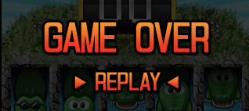

<!-- .slide: data-background="#000" -->
# CSS PANICを支える技術(?)

[UIT meetup vol.7 集まれ！（タブン）実務では使わないフロントエンド芸発表会](https://uit.connpass.com/event/138084/)

---

- [@GeckoTang](https://twitter.com/geckotang)
- 坂巻 翔大郎
- 株式会社ピクセルグリッド

---

## CSS PANIC
<video data-autoplay src="./media/game.mp4" loop controls></video>

https://codepen.io/geckotang/pen/wLXZvr

---

## CSS PANICって何がどうなの？

- 2012年頃に作りました（7年前！）※
- JavaScriptを使っていない
- HTMLとCSSで作られたワニワニパニック風（？）のゲーム
- 画像も全部自分で作りました

<hr>

<small>※jsdo.itで公開したのが2011年とかそこらへん。<br>jsdo.itだと見れないことが多いのでCodePenに移植しました</small>

---

## すごいけど実は二番煎じ

ndrugerさんの作った[javascriptを使わず、html + cssだけでクリックシューティングゲームを作ってみた](https://ndruger.hatenadiary.org/entry/20110428/1304021590)が基本となる仕組みです。

私はそこに、ゲームのプレイ画面とゲームオーバー画面、そして見た目をつけて整えただけ。

---

## CSS PANICを支えている技術

- <span class="-hl">状態の管理</span>
  - <span class="-hl">`input`要素</span>
  - <span class="-hl">`:checked`擬似クラス</span>
- 見た目の装飾
    - base64 encode dataURI
    - `apperance`プロパティ
- 動き
  - CSS Animations

---

## 状態の管理

1. プレイ画面の制限時間の管理
2. ワニをクリックしたとき
3. もう一度遊ぶ

---

## 1.プレイ画面の制限時間の管理

1. 一定時間後ゲームを終了させたい
2. 残り時間を示すゲージ

---

### 1-1. 一定時間後ゲームを終了させたい
<div class="split">

<div class="split-left">



- 一定時間後に、ゲームができなくなれば良い
- ゲームオーバーの画面を被せればよいのでは...?
- ゲームオーバーの画面を画面外に隠しておいて、一定時間後に表示されるようにした

</div>

<div class="split-right">

```html
<div id="game">
  <a id="gameover" href="https://..."></a>
  <div id="timer"><div id="progress"></div></div>
  <div id="map">
```

```css
/* setting : gameover  */
#gameover{
    position: absolute;
    top:0;
    left:0;
    -webkit-animation-name:gameover;
    -webkit-animation-timing-function:linear;
    -webkit-animation-duration:13s;
    -webkit-animation-delay:0.5s;
    opacity:1;
}
@-webkit-keyframes gameover{
      0% {top:-465px;opacity:1;}
      97% {top:-465px;opacity:0;}
    100% {top:0px;opacity:1;}
}
```

</div>

</div>

<hr>
<small>今だったらtransitionでやるかもしれないけど、当時はこうしてたらしい。</small>

---

### 1-2. 残り時間を示すゲージ

<div class="split">
<div class="split-left">

<video data-autoplay src="./media/gauge.mp4" loop controls></video>

- なくてもいいと思うけど、あるとゲームっぽいので。
- 幅が0pxの状態から12.5sかけて200pxになる。

</div>
<div class="split-right">

```html
<div id="game">
  <a id="gameover" href="https://..."></a>
  <div id="timer"><div id="progress"></div></div>
  <div id="map">
```

```css
#timer{
    position: absolute;
    top:310px;
    left:5px;
    z-index:10;
    width: 309px;
    height: 50px;
}
#progress{
    position: absolute;
    top:7px;
    left:97px;
    width:200px;
    height: 36px;
    -webkit-animation-name:progress;
     -webkit-animation-timing-function:linear;
    -webkit-animation-duration:12.5s;
    -webkit-animation-delay:0.5s;
}
@-webkit-keyframes progress{
    0% {width:0px;}
    100% {width:200px;}
}
```

</div>
</div>

---

## 2.ワニをクリックしたとき

1. 吹き出しを表示する
2. スコアのカウントアップ

---

### 2-1. 吹き出しを表示する

<div class="split">
<div class="split-left">

<video data-autoplay src="./media/enemy.mp4" loop controls></video>

- ワニが`:checked`になったら
  - ワニのアニメーションを終了、クリックできないようにして、非表示にする
  - ワニのラジオボタンに隣接する位置に、「痛っ」の吹き出しがあるので表示

</div>
<div class="split-right">

```html
<div id="enemy">
  <input type="radio" name="enemy_1"  id="enemy_1"  class="enemys"><div class="effect"></div>
  <input type="radio" name="enemy_2"  id="enemy_2"  class="enemys"><div class="effect"></div>
```

```css
.enemys:checked {
    overflow:hidden;
    -webkit-animation-name:none;
    -webkit-pointer-events: none;
    pointer-events: none;
    opacity:0;
}
.enemys:checked + .effect{
  -webkit-animation-duration:0.5s;
  -webkit-animation-iteration-count:1;
  -webkit-animation-direction: normal;
}
```

</div>
</div>

---

### :checkedでなにかする

<div class="split">
<div class="split-left">

<video data-autoplay src="./media/checked.mp4" loop controls></video>

- `input:checked`と隣接セレクタ等を組み合わせれば、チェックされたときにいろいろな要素をいじることができる
- ON/OFFできる便利なスイッチ

</div>
<div class="split-right">

```html
<label>
  <input type="radio" name="foo">項目
  <span>←選択中</span>
</label>
<label>
  <input type="radio" name="foo">項目
  <span>←選択中</span>
</label>
```

```css
label { display: block; }
input + span { display: none; color: tomato; }
input:checked + span { display: inline; }
```

</div>
</div>
---

### 2-2. スコアのカウントアップ

<div class="split">
<div class="split-left">

<video data-autoplay src="./media/score.mp4" loop controls></video>

- あらかじめスコアのほうに、ワニと対になるラジオボタンを用意しておく
- ワニにチェックが入ると、スコアの方のラジオボタンのチェックが外れる
- そうすると高さが0になってスコアがカウントアップする

</div>
<div class="split-right">

```html
<div id="score">
  <input type="radio" name="enemy_1"  id="score_1"  class="score" checked>
  <!-- 省略 -->
  <input type="radio" name="enemy_10" id="score_10" class="score" checked>
  <div class="score" id="score_11"></div>
</div>
```

```css
.score{
    position:relative;
    display:block;
    width: 111px;
    height: 63px;
    background-color:transparent;
    -webkit-appearance: button;
    -moz-appearance: button;
    -webkit-transition:.1s all linear;
}
.score:checked{
    position:absolute;
    top:0px;
    height:0px;
}
```

</div>
</div>

---

### スコアのカウントアップの仕組み

<div class="split">
<div class="split-left">

<video data-autoplay src="./media/countup.mp4" loop controls></video>

- スプライト画像をずらして表示させている
- [codepen](https://codepen.io/geckotang/pen/bXEego)

</div>
<div class="split-right">

```css
.score input {
  display: block;
  width: 100px;
  height: 100px;
  margin: 0;
  outline: 1px dashed green;
  transition: 0.5s height linear;
}
/* ワニがチェックされていないとき */
.score input:checked {
  position: absolute;
  width: 0;
  height: 0;
}
```

```html
<div class="score">
  <div class="score_inner">
    <input type="radio" name="foo-1" checked>
    <input type="radio" name="foo-2" checked>
    <input type="radio" name="foo-3" checked>
    <svg viewBox="0 0 100 400" width="100px"><use xlink:href="#score"></use></svg>
  </div>
</div>
<div class="enemy">
  <label><input type="radio" name="foo-1">ワニ1</label>
  <label><input type="radio" name="foo-2">ワニ2</label>
  <label><input type="radio" name="foo-3">ワニ3</label>
</div>
```

</div>
</div>

---

## 3.もう一度遊ぶ

<div class="split">
<div class="split-left">


</div>
<div class="split-right">

```html
<a
  id="gameover"
  href="https://s.codepen.io/geckotang/debug/wLXZvr/dGMXWdwNvRbk">
</a>
```

- :checkedとかで、うまいことやる？
- いやいや
- リンクをクリックさせて同じページを表示させれば...
- もう一回遊べるドン！

</div>
</div>

---

## CSS PANICを支えている技術

- 状態の管理
  - `input`要素
  - `:checked`擬似クラス
- <span class="-hl">見た目の装飾</span>
    - <span class="-hl">base64 encode dataURI</span>
    - <span class="-hl">`apperance`プロパティ</span>
- 動き
  - CSS Animations

---

## 見た目の装飾

1. ゲームで使う画像
2. ラジオボタンの見た目

---

### 1. ゲームで使う画像

- 画像のほとんどはCSSに埋め込まれている
  - jsdo.itに画像をアップロードする仕組みがなかった
  - なのでbase64 encodeして埋め込んだ

```css
#gameover{
    background-image: url("data:image/png;base64,iVBORw0KGgoAAAANSUhEUgAAAT8A\
    AAF3CAYAAADTrUyqAAAAGXRFWHRTb2Z0d2FyZQBBZG9iZSBJbW\
    ...");
}
```

---

### 2. ラジオボタンの見た目

- ラジオボタン（input要素）の見た目を自由にしたい
- `appearance`プロパティを使って見た目を変えられるようにする
  - CSS PANICでは`-webkit-apperance: button;`を使っているけど`none`でよい気がする。

---

## CSS PANICを支えている技術

- 状態の管理
  - `input`要素
  - `:checked`擬似クラス
- 見た目の装飾
    - base64 encode dataURI
    - `apperance`プロパティ
- <span class="-hl">動き</span>
  - <span class="-hl">CSS Animations</span>

---

## 動き

ワニはこんな動きをしています。

<video data-autoplay src="./media/game-no-wall.mp4" loop controls></video>

---

## CSS...

ワニ動き職人が丁寧にひとつひとつ...

```css
@-webkit-keyframes enemy_10{
      0% {-webkit-transform:translateY(0px);}
     5% {-webkit-transform:translateY(120px);}
     30% {-webkit-transform:translateY(0px);}
     60% {-webkit-transform:translateY(0px);}
     90% {-webkit-transform:translateY(0px);}
    100% {-webkit-transform:translateY(0px);}
}
#enemy_10{
    -webkit-animation-name:enemy_10;
    -webkit-animation-duration:10s;
    -webkit-animation-delay:1s;
}
```

無理ゲーにならないように調整しました。

---

## おまけ

CSS PANICの話はおわり

1. JSを使わないでやる必要あった？
2. なにか役に立った？

---

### 1.JSを使わないでやる必要あった？

- ない
- でも、当時はJSもたいして書けなかった
- JSを使わないで、いろいろできそうだったから...つい...

---

### 2.なにか役に立った？

- 実務にそのまま使うことはない
- トリッキーな考え方は稀に実務で役に立つ
- 色々遊んだ結果、得た知識がCodeGridの原稿になったり、こうやって話してたりできた

---

## おわり

スコアをツイートできる版をつくってみました。


[codepen](https://s.codepen.io/geckotang/debug/BXjQmN/NjMYzqojbYRr)
